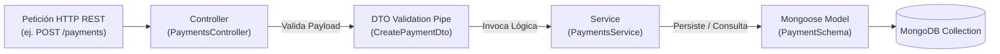

# ⚡ Estándar Oficial de Desarrollo Backend (`SFA-Backend`)

Este documento define las **Normas y Estándares Oficiales de Arquitectura y Desarrollo** para el Backend del **IESTP San Francisco de Asís**.

---

## 🎯 Patrón de Arquitectura: NestJS Domain-Driven Layered Modular Architecture

El Backend aplica la arquitectura recomendada por **NestJS**, siguiendo el patrón **Monolito Modular Basado en Capas de Dominio (Domain Layered Modular Monolith)**.

---

## 📐 Estructura Estándar de Módulo NestJS

Cada módulo de dominio (ej. `applicants`, `enrollments`, `payments`, `students`, `courses`, `teachers`, `users`) cumple estrictamente la siguiente jerarquía de 5 capas:

```text
src/{modulo}/
├── schemas/
│   └── {modulo}.schema.ts       # CAPA 1: PERSISTENCIA (Mongoose Schema & Indices Mongo)
├── dto/
│   └── create-{modulo}.dto.ts   # CAPA 2: VALIDACIÓN (Class-Validator & Data Transfer Objects)
├── {modulo}.service.ts          # CAPA 3: LÓGICA DE NEGOCIO (Injectable NestJS Service)
├── {modulo}.controller.ts       # CAPA 4: EXPOSICIÓN REST (HTTP Routes & Controllers)
└── {modulo}.module.ts           # CAPA 5: MÓDULO NESTJS (Registro e inyección en AppModule)
```

---

## 🔄 Flujo Interno de Datos en Backend



---

## 📋 Reglas Obligatorias de Backend

1. **DTOs:** Toda entrada de datos debe estar tipada y validada con `class-validator` y `class-transformer`.
2. **Índices en MongoDB:** Los campos de búsqueda frecuente (`studentDni`, `dni`, `email`, `code`, `date`) deben contar con un índice explícito en el esquema de Mongoose.
3. **Formato de Commits:** Respetar la regla `[VERBO] + [OBJETO]` en español (`Agrega`, `Implementa`, `Integra`, `Refactoriza`, `Corrige`, `Actualiza`).
